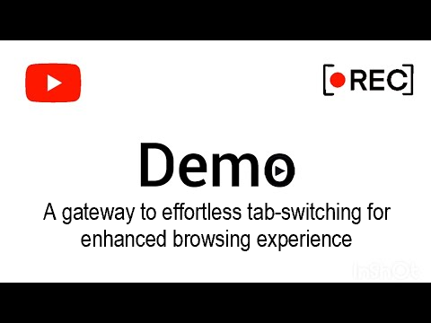

# Odin Tabs Extension 👁️🎤🔍

Odin Tabs is a browser extension that allows you to navigate through your browser tabs using speech recognition and the Large Language Model (LLM) of your choice. 🗣️💬

📺 Watch the video below for a full demo:

## Use Cases 📋🔍

Discover the game-changing capabilities of Odin Tabs, a versatile Chrome extension designed to enhance your browsing experience across various scenarios:

🌐 **Empowering Independence:** Odin Tabs promotes independence and autonomy for individuals with motor impairments. It eliminates barriers that might otherwise hinder their ability to access information, communicate, and engage with online content.

📊 **Data Analysis and Research:** Seamlessly switch tabs while working with data sources, research papers, and statistical tools for efficient analysis.

💰 **Financial Trading:** Navigate financial news, stock charts, trading platforms, and research reports with ease.

💻 **Programming and Coding:** Swiftly switch between tabs for documentation, code editors, and online repositories to streamline coding tasks.

📝 **Content Curation:** Manage content and social media across tabs—scheduling, analytics, and content creation tools at your fingertips.

📈 **Marketing Campaigns:** Effortlessly manage ad platforms, analytics dashboards, and creative assets for effective campaigns.

🗂️ **Project Management:** Collaborate seamlessly using Odin Tabs for project management tools, communication platforms, and shared documents.

📚 **Online Learning:** Navigate course materials, lecture videos, assignments, and discussion forums with ease on online learning platforms.

🔍 **Competitive Analysis:** Switch between tabs for competitor websites, industry reports, and market data sources during analysis.

📱 **Device Management:** Manage devices effortlessly—switch between tabs for device interfaces, syncing services, and cross-device communication.

Experience the future of browsing with Odin Tabs and its wide-ranging applications!

## Functionality 🛠️📚

The extension consists of the following components:

- **Background Script (`background.js`):** Listens for messages from the popup or content scripts and handles the communication between them. It manages tab opening and reloading and stores user settings in the local storage.

- **Popup Script (`popup.js`):** Represents the popup window of the extension. It allows the user to start speech recognition, view the recognized speech text, configure settings, and displays a face emoji based on the state of the speech recognition.

- **Popup HTML (`popup.html`):** The HTML markup for the popup window. It contains the necessary elements to display the face emoji, buttons, and recognized speech text.

- **Speech-to-Text Script (`odinTabs.js`):** Handles the speech recognition functionality. It utilizes the Web Speech API to convert spoken words into text. The recognized text is then further processed using the LLM of your choice (currently gpt-turbo-3.5), and the results are used to perform tab navigation.

- **Speech-to-Text HTML (`speechToText.html`):** The HTML markup for the speech-to-text page. It includes a container to display the recognized speech text.

## Installation 🚀🔧

To install the Odin Tabs extension, follow these steps:

1. Download or clone the extension code from the repository.

2. Open Google Chrome and navigate to `chrome://extensions`.

3. Enable the **Developer mode** using the toggle switch located at the top right corner of the page.

4. Click on the **Load unpacked** button.

5. Select the folder containing the extension code and click **Open**.

6. The Odin Tabs extension should now appear in the list of installed extensions. Ensure the extension is enabled.

7. Click on the extension icon in the Chrome toolbar to open the popup window.

8. The popup window provides options to start speech recognition, configure settings, and view the recognized speech text.

9. Click on the **Start Speech Recognition** button to begin the speech-to-text functionality. Allow microphone access if prompted.

10. Speak into the microphone, and the recognized speech text will be displayed in the popup window.

11. Odin Tabs will use the recognized text to perform tab management actions. For example, the extension will activate the relevant tab.

12. The face emoji in the popup window will change based on the state of the speech recognition. For example, it will display a sleeping emoji when the speech recognition stops.

## Configuration ⚙️🔧

The Odin Tabs extension provides a settings option that allows you to configure a setting value. Here's how to configure the settings:

1. Click on the extension icon in the Chrome toolbar to open the popup window.

2. Click on the **Settings** button.

3. A prompt will appear asking you to enter a valid key. Enter the desired value and click **OK**.

4. The setting value will be stored in the local storage.

5. After setting the value, the **Start Speech Recognition** button will be enabled, and the face emoji will change to an active state.

## Notes 📝🚀

- The extension requires microphone access to perform speech recognition. Make sure to grant microphone permissions when prompted.

- The extension uses the OpenAI API for generating text responses. To use this feature, you need to provide a valid API key. The API key can be set through the settings option.

- This extension is provided as an example and may require additional modifications or improvements to suit your specific use case.

- The extension's functionality and behavior may be subject to changes and limitations imposed by browser updates or API changes.

## Credits 👨‍💻📚

The Odin Tabs extension was developed by Dr. Leonit Zeynalvand and is provided under the MIT license. 📜🔓
